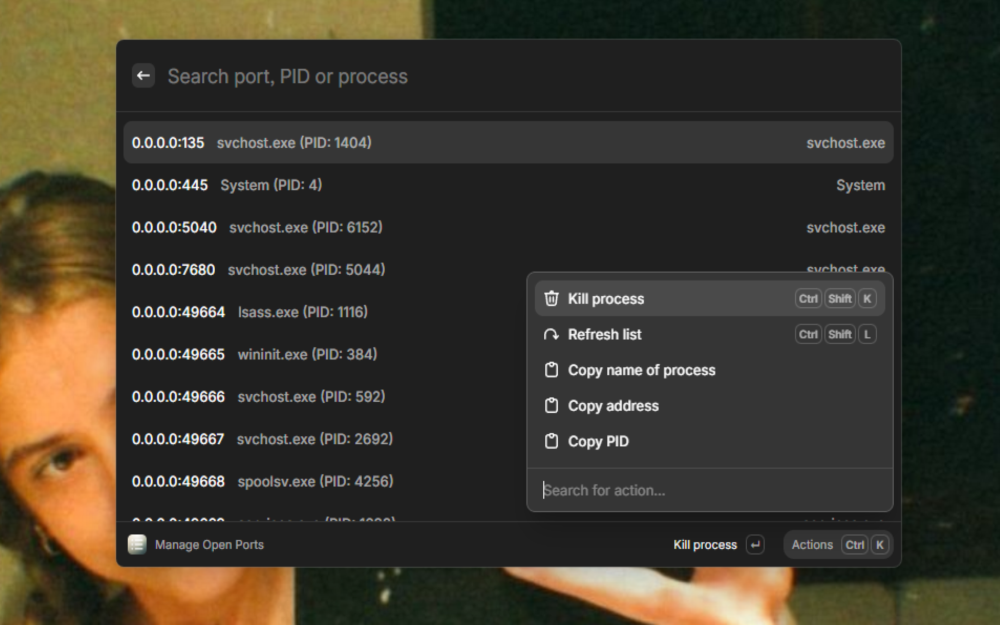

# Port Manager

A powerful Raycast extension for monitoring and managing open ports on your Windows system. Quickly view all active TCP ports, identify which processes are using them, and terminate processes with a single action.


## Features

- **Port Monitoring**: View all open TCP ports on your system in real-time
- **Process Identification**: See which processes are using specific ports with process names and PIDs
- **Quick Process Termination**: Kill processes using specific ports with a single action
- **Search & Filter**: Search through ports by address, PID, or process name
- **Copy Actions**: Copy port addresses, PIDs, or process names to clipboard
- **Keyboard Shortcuts**: Quick actions with customizable shortcuts
- **Real-time Updates**: Refresh the port list to see current system state
- **Error Handling**: Robust error handling with user-friendly notifications

## Screenshots

### Main Interface


### Action Panel


## Installation

1. Install [Raycast](https://raycast.com/) on your Windows system
2. Open Raycast and search for "Port Manager"
3. Install the extension from the Raycast Store
4. Grant necessary permissions when prompted

## Usage

### Opening Port Manager
- Open Raycast (`Win + Space` by default)
- Type "Manage Open Ports" or "ports"
- Press Enter to launch the extension

### Managing Ports
1. **View Ports**: All open TCP ports are displayed with their local addresses
2. **Identify Processes**: Each port shows the process name and PID using it
3. **Search**: Use the search bar to filter by port address, PID, or process name
4. **Kill Process**: Select a port and press `Ctrl+Shift+K` or use the "Kill Process" action
5. **Refresh**: Press `Ctrl+Shift+L` or use the "Refresh List" action to update the port list

### Available Actions

| Action | Shortcut | Description |
|--------|----------|-------------|
| Kill Process | `Ctrl+Shift+K` | Terminate the process using the selected port |
| Refresh List | `Ctrl+Shift+L` | Update the port list with current system state |
| Copy Process Name | - | Copy the process name to clipboard |
| Copy Address | - | Copy the port address to clipboard |
| Copy PID | - | Copy the process ID to clipboard |

## Technical Details

### System Requirements
- Windows 10/11
- Raycast application
- Administrator privileges (for process termination)

### How It Works
The extension uses Windows system commands to gather port information:
- `netstat -ano -p tcp`: Lists all TCP connections and their associated PIDs
- `tasklist /fo csv`: Retrieves process names for the identified PIDs
- `taskkill /PID <pid> /F`: Terminates processes by their PID

### Architecture
- **Frontend**: React-based UI using Raycast's API
- **Port Detection**: Native Windows commands via Node.js child_process
- **Process Management**: Direct system command execution for process termination
- **State Management**: React hooks for real-time UI updates

## Development

### Prerequisites
- Node.js 18+
- npm or yarn
- Raycast CLI

### Setup
```bash
# Clone the repository
git clone <repository-url>
cd ports

# Install dependencies
npm install

# Start development mode
npm run dev
```

### Available Scripts
- `npm run dev` - Start development mode
- `npm run build` - Build the extension
- `npm run lint` - Run ESLint
- `npm run fix-lint` - Fix ESLint issues
- `npm run publish` - Publish to Raycast Store

### Project Structure
```
ports/
├── src/
│   └── index.tsx          # Main React component
├── lib/
│   ├── fetchPorts.ts      # Port detection logic
│   └── killProcess.ts     # Process termination logic
├── metadata/
│   ├── screenshot1.png    # Main interface screenshot
│   └── screenshot2.png    # Action panel screenshot
├── assets/
│   └── extension.png      # Extension icon
└── package.json           # Extension configuration
```

## Contributing

1. Fork the repository
2. Create a feature branch (`git checkout -b feature/amazing-feature`)
3. Commit your changes (`git commit -m 'Add some amazing feature'`)
4. Push to the branch (`git push origin feature/amazing-feature`)
5. Open a Pull Request

## License

This project is licensed under the MIT License - see the [LICENSE](LICENSE) file for details.

## Author

**dleteliers_**

## Changelog

### [🎂 Added Port Manager] - (2025-09-21)

- Add port monitoring functionality to view all open TCP ports
- Add process identification with process names for each port
- Add ability to kill processes using their PID
- Add search functionality to filter ports by address, PID, or process name
- Add copy actions for port address, PID, and process name
- Add keyboard shortcuts for common actions (Ctrl+Shift+K to kill, Ctrl+Shift+L to refresh)
- Add real-time port detection and management
- Add Windows-specific implementation using netstat and tasklist commands
- Add loading states and error handling
- Add toast notifications for successful operations
- Add responsive UI with Raycast List component
- Add action panel with contextual actions for each port

## Support

If you encounter any issues or have questions:
1. Check the [Issues](https://github.com/your-username/ports/issues) page
2. Create a new issue with detailed information
3. Include your Windows version and Raycast version

---

**Note**: This extension requires administrator privileges to terminate processes. Make sure to run Raycast with appropriate permissions when using the kill process functionality.
